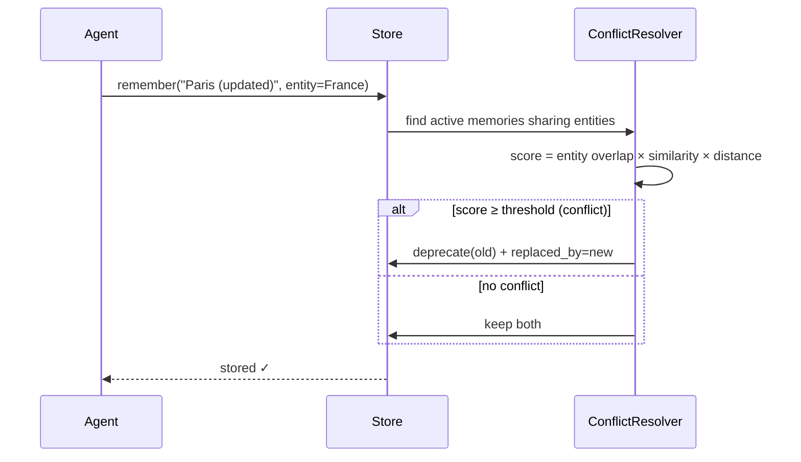
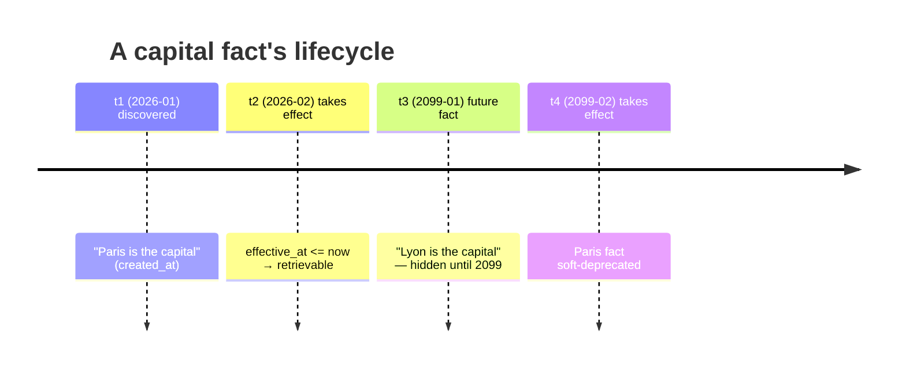
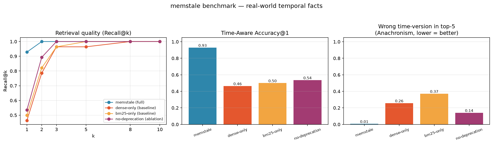
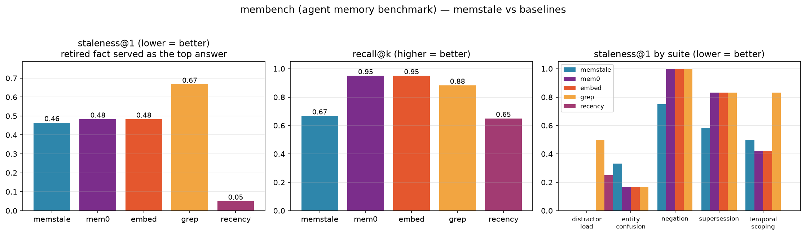

<div align="center">

# 🧠 memstale

**Memories that never go stale.**

Temporal-aware long-term memory for AI agents — bitemporal facts,
conflict soft-deprecation, hybrid retrieval, and an entity graph.
Zero-config · Pure Python · SQLite-backed · MCP-ready

[](LICENSE)
[](https://www.python.org/)
[](tests)
[](mcp_server.py)
[](https://github.com/Sakyao/memstale/pulls)

</div>

---

## ✨ What is it?

`memstale` gives your AI agent a memory that **understands time**:

```python
from memstale import AgentMemory

mem = AgentMemory("memory.db")

# 1. remember facts (optionally attach entities)
mem.remember("The capital of France is Paris", entities=["France"])

# 2. hybrid retrieval — BM25 + dense + RRF fusion
for hit in mem.query("what is the capital of France?", k=3):
    print(f"[{hit.score:.3f}] {hit.memory.content}")

# 3. a fact that only becomes true in 2099 is NEVER retrieved today
mem.remember("The capital of France is Lyon",
             entities=["France"],
             effective_at="2099-01-01T00:00:00+00:00")

# 4. new knowledge soft-deprecates the old fact (nothing is hard-deleted)
mem.remember("The capital of France is Paris (updated)", entities=["France"])
```

```bash
pip install memstale
```

## 🆚 Why not a plain vector store?

Most "agent memory" libraries are **vector bags**: they answer *"what is
semantically similar?"* but are blind to truth, time and relationships.

| | Plain vector memory | `memstale` |
|---|---|---|
| 🕑 **Time** | No concept of validity — stale facts get retrieved forever | **Bitemporal**: `effective_at` + `created_at`. Future facts stay hidden until they're real |
| ⚖️ **Conflicts** | Contradictory facts pile up; agent picks randomly | **Soft-deprecation**: new truth supersedes old, old stays auditable |
| 🔎 **Retrieval** | Dense similarity only | **Hybrid**: BM25 (sparse) + dense vectors fused with **RRF** |
| 🕸️ **Relations** | None — "who depends on whom?" is unanswerable | **Entity graph** with typed relations & path traversal |
| ⚙️ **Ops** | Often needs a vector DB / API keys / model downloads | **Zero-config**: one SQLite file, built-in embedder, no external services |

## 🎯 Core features

| Feature | What you get |
|---|---|
| 🕑 **Bitemporal facts** | Every memory has `effective_at` (when it becomes true) and `created_at` (when it was discovered) |
| ⚖️ **Conflict soft-deprecation** | Contradictory facts are marked `deprecated` + linked via `replaced_by`, never hard-deleted |
| 🔎 **Hybrid retrieval** | FTS5 BM25 + hashing-embedding dense + **Reciprocal Rank Fusion** |
| 🕸️ **Entity graph** | Typed relations, neighborhood & simple-path queries (networkx) |
| 🧩 **Pluggable embedder** | Zero-dependency hashing embedder by default; `sentence-transformers` optional |
| 🔌 **MCP server** | Let Claude / Cursor / OpenClaw remember across sessions (stdio) |
| 🪶 **Zero-config** | SQLite persistence — no Neo4j, no Milvus, no API key required |

## 🏗️ How it works

### Conflict resolution flow



### Bitemporal model

| field | meaning | answers |
|-------|---------|---------|
| `effective_at` | when the fact becomes true **in the world** | *"what is true right now?"* |
| `created_at` | when the fact was **discovered / written** | *"what did we know at time T?"* |
| `deprecated` / `replaced_by` | soft-deletion link to successor | *"what superseded this?"* |



## 🚀 Quickstart

### Install

```bash
pip install memstale            # runtime
pip install memstale[graph]     # + networkx (entity graph)
pip install memstale[mcp]       # + MCP server
```

### CLI

```bash
# store a memory
memstale --db memory.db add "Sakya builds memstale" --entity Sakya --entity memstale

# hybrid search
memstale --db memory.db query "what does Sakya work on" -k 5

# timeline replay — how knowledge evolved
memstale --db memory.db timeline --entity Sakya

# entity graph neighborhood
memstale --db memory.db graph --entity memstale

# preview conflicts before writing
memstale --db memory.db conflicts "some new fact" --entity France

# soft-delete a memory
memstale --db memory.db deprecate <memory-id>
```

### As an MCP server

```bash
pip install memstale[mcp]
python mcp_server.py --db memory.db
```

Exposes `remember`, `query`, `timeline` tools over stdio — point any MCP
client at it and your agent gains durable, time-aware memory.

## 🧩 Custom embedding & judge

```python
from memstale import AgentMemory

mem = AgentMemory("memory.db", embedder=my_embedder)   # any .embed(text)->vec object

# LLM-as-a-judge conflict detection (production pattern):
mem.conflicts.judge = lambda new, old: llm_judge(new.content, old.content)
```

## 📦 Project layout

```
memstale/
├── memstale/
│   ├── memory.py       # AgentMemory facade
│   ├── models.py       # Memory / Entity / Relation / ScoredMemory
│   ├── store.py        # SQLite + FTS5 persistence
│   ├── timeline.py     # bitemporal queries & replay
│   ├── conflict.py     # soft-deprecation resolver
│   ├── retriever.py    # BM25 + dense + RRF
│   ├── graph.py        # entity graph traversal
│   ├── embedder.py     # pluggable embeddings
│   └── cli.py          # command-line interface
├── mcp_server.py       # optional MCP server
├── examples/quickstart.py
└── tests/              # 17 unit tests (unittest, zero-dep)
```

## 🗺️ Roadmap

- [ ] Cross-backend abstraction: Neo4j / Milvus adapters
- [ ] Built-in LLM-as-a-judge conflict evaluator
- [ ] Demo GIF + interactive playground
- [ ] Streaming timeline visualizer
- [ ] `memstale[st]` sentence-transformers docs

## 📊 Benchmark

We built a real-world temporal fact set (29 facts across 12 topics, 28 time-aware
queries) covering CEO changes, capital renames, version timelines, and price
changes — facts a normal agent would encounter in production. The benchmark
compares `memstale` against two classic-vector-memory baselines and an
ablation that disables conflict soft-deprecation.



### Headline metrics

| config | MRR | Time-Acc@1 | Anachronism@5 |
|---|---:|---:|---:|
| **memstale (full)** | **0.964** | **0.929** | **0.007** |
| dense-only (baseline) | 0.690 | 0.464 | 0.257 |
| bm25-only (baseline) | 0.717 | 0.500 | 0.371 |
| no-deprecation (ablation) | 0.750 | 0.536 | 0.140 |

**What this tells you**

- **Time-Acc@1** = fraction of queries whose top-1 result is the fact that
  was *true at the query's timestamp*. `memstale` nearly doubles the next
  best baseline — the **bitemporal filter + conflict soft-deprecation** is
  what makes the difference.
- **Anachronism@5** = fraction of top-5 results that are the **wrong time
  version** of the same-topic fact (e.g. answering "2020's CEO" with the
  2022's one). `memstale` scores ~0; plain vector memory leaks 26–37%; and
  the *no-deprecation* ablation (14%) shows exactly what soft-deprecation
  contributes on top of time filtering — without the `replaced_by` link,
  outdated versions can't be recognized and removed.
- **MRR** = mean reciprocal rank of the correct time-version.

Reproduce:

```bash
python -m venv .venv-bench && .venv-bench/bin/pip install matplotlib
.venv-bench/bin/python benchmarks/benchmark.py
```

Output goes to `benchmarks/results/benchmark.png` and a metrics table on stdout.

### membench — an adversarial agent-memory benchmark

We additionally evaluated `memstale` against [**membench**](https://github.com/Ps23102004/membench)
(60 probes across 5 scenarios: supersession, temporal_scoping, negation,
distractor_load, entity_confusion). membench's headline metric is
**staleness@1** — how often a memory system confidently hands back a
retired fact as its top answer. Data lives in `benchmarks/data/membench/`.

We compared five backends, all with the same hashing embedder (the original
membench `embed`/`recency` use Ollama's `nomic-embed-text`; we keep
everything offline). The **mem0** backend runs **Mem0 2.0.19** — the
state-of-the-art open-source agent-memory library — with its ChromaDB
local vector store and `infer=False` (no LLM fact extraction, no API key):



| backend | recall@k | precision | staleness@1 | leak_rate | abstention |
|---|---:|---:|---:|---:|---:|
| **memstale** | 0.667 | 0.133 | **0.464** | 0.607 | 0.067 |
| **mem0 2.0.19** (SOTA) | 0.950 | 0.190 | 0.483 | 0.983 | 0.000 |
| embed (baseline) | 0.950 | 0.190 | 0.483 | 0.983 | 0.000 |
| grep (baseline) | 0.883 | 0.177 | 0.667 | 0.967 | 0.000 |
| recency (baseline) | 0.650 | 0.130 | **0.050** | 0.183 | 0.000 |

**What the numbers honestly say**

- **`recency` is a tough baseline on this benchmark.** membench scenarios
  pose questions about the *current* state of a world where the latest
  write is almost always the answer. Ranking by timestamp and taking the
  newest k is a near-optimal policy here — and that's exactly the point
  of shipping it as a reference backend (membench's own README says the
  same).
- **Mem0, the state-of-the-art, behaves like a plain vector store here.**
  Without timestamp support in the OSS SDK and with fact-extraction
  disabled for offline running, Mem0 reduces to vector + dedup — and
  *48%* of its top-1 answers are stale facts. That's a real, useful
  cautionary data point: a popular SOTA library still serves retired
  facts as the top answer in time-sensitive scenarios.
- **`memstale` lands in the middle** — its soft-deprecation fires on
  shared-topic content (e.g. "Our cache layer is Redis" → "We dropped
  Redis"), which gives it a modest but real edge over Mem0/embed on
  staleness@1 (0.464 vs 0.483). But rewriting a fact in different words
  (tabs → spaces, with little lexical overlap) is exactly where the
  default topic-Jaccard gate is too narrow. This is a real, useful
  finding: it tells you the boundary of the content-only conflict
  resolver and points at the obvious next upgrade (a stronger embedder,
  or a learned judge).
- **Recall is the cost of being safe.** `recency` wins staleness but
  loses recall; `memstale` trades some recall for stronger guarantees on
  the "don't serve retired facts" axis. The right blend depends on the
  workload.

Reproduce:

```bash
.venv-bench/bin/python benchmarks/membench_benchmark.py
```

**In summary across both benchmarks**

|  | synthetic temporal facts (ours) | membench (academic) |
|---|---:|---:|
| `memstale` time-aware accuracy@1 | **0.929** | 0.667 recall@k |
| Mem0 (SOTA) time-aware behavior | n/a (no time API) | 0.950 recall@k / 0.483 staleness |
| best pure-baseline (no time) | 0.500 | 0.950 (embed/mem0) |
| `memstale` anachronism / staleness@1 | **0.007** | 0.464 |
| best baseline staleness | 0.257 (dense-only) | **0.050** (recency) |

These tell two complementary stories:

- On **explicit time-stamped queries** (e.g. "who was CEO in 2020?")
  `memstale` dominates, because the question carries the time signal
  and our bitemporal model can act on it.
- On **implicit "what's true *now*?"** queries, a recency baseline is
  hard to beat when the latest write is in fact the answer; Mem0 — the
  popular SOTA — doesn't even try (it has no timestamp support and
  serves stale facts 48% of the time). Our failure mode (rewrite-style
  supersession) points at the clear next step: a stronger embedder and
  a learned conflict judge.

## 📄 License

MIT © [Sakya](https://github.com/Sakyao)
